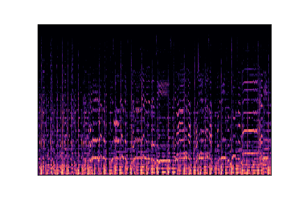

# Music Genre Classifier

This project is a music genre classification, using two distinct services: SVM_service and vgg19_service. These services, hosted in the same Docker container, are designed to classify the musical genre of an audio file in WAV format, transmitted as base64 encoded data.

## Features

- svm_service: Uses a Support Vector Machine (SVM) model to classify music genres.
- vgg19_service: Uses a VGG19 model to perform classification.
- User-friendly web interface.

## Data

The Machine Learning models are trained on the datasetGTZAN dataset which offers a variety of musical genres, available on Kaggle :

   ```bash
   https://www.kaggle.com/datasets/andradaolteanu/gtzan-dataset-music-genre-classification
   ```

## Project Structure

The repository is organized as follows:

- `my_app/`: Front-end application
- `svm_service/`: SVM classifier service
- `vgg19_service/`: VGG19 classifier service
- `tests/`: Tests for both SVM and VGG19 services
- `docker-compose.yml`: Docker Compose configuration
- `Jenkinsfile`: Jenkins pipeline script
- `requirements.txt`: Python dependencies
- `test-reports/`: JUnit test reports

### Prerequisites

Make sure you have the following tools installed:

- Docker
- Python 3.8

### Installation

1. Clone the repository:

   ```bash
   git clone https://github.com/alaadoukh/Music-Genre-Classifier.git
   cd Music-Genre-Classifier

2. Build the Docker containers:
   ```bash
   docker-compose up --build -d

3. Access the application at http://localhost:3000

## Usage

### Uploading a Music File

1. Open the web application.
2. Click on the "Choose a music file" button.
3. Select an audio file (WAV format).
4. Click "Upload and Classify."

### Uploading an Image File

1. Open the web application.
2. Click on the "Choose an image file" button.
3. Select an image file (PNG format). Here's an example:
   
4. Click "Upload and Classify."